# Budget Dashboard App

[](https://github.com/OWNER/REPO/actions/workflows/ci.yml)
<!-- Replace OWNER/REPO above with your GitHub org/repo slug to enable the badge. -->

A React web application for tracking and managing budget expenses based on credit card transactions.

## Features

- **Transaction Table**: Displays categorized transactions with date, description, category, and amount
- **Budget Management**: Set budget amounts for each expense category
- **Budget vs Actual Chart**: Visual comparison between budgeted and actual spending using bar charts
- **Spending Distribution**: Pie chart showing overall spending breakdown by category
- **Category-based Organization**: Transactions automatically categorized based on Merchant Category Codes (MCC)

## Categories Supported

The app automatically categorizes transactions into the following categories:
- Grocery
- Gas & Fuel
- Department Store
- Fast Food
- Online Retail
- Coffee Shop
- Home Improvement
- Wholesale Club
- Entertainment
- Pharmacy
- Transportation
- Electronics
- Restaurant
- Health & Fitness

## Technology Stack

- **React 18** with TypeScript
- **Recharts** for data visualization
- **CSS3** for styling with responsive design
- **React Hooks** for state management

## Getting Started

### Prerequisites
- Node.js (version 14 or higher)
- npm or yarn

### Installation

1. Navigate to the project directory:
```bash
cd budget-dashboard-app
```

2. Install dependencies:
```bash
npm install
```

3. Start the development server:
```bash
npm start
```

4. Open your browser and visit `http://localhost:3000`

### Building for Production

```bash
npm run build
```

## Data Structure

The app uses a sample dataset with the following transaction structure:

```json
{
  "id": 1,
  "date": "2024-01-15",
  "description": "Walmart Supercenter",
  "amount": 134.09,
  "category": "Grocery",
  "mcc": "5411"
}
```

## Components

- **App.tsx**: Main application component with state management
- **TransactionsTable.tsx**: Displays transaction data in a responsive table
- **BudgetSettings.tsx**: Allows users to set and edit budget amounts per category
- **Charts.tsx**: Renders budget vs actual and pie charts using Recharts

## Features in Detail

### Transactions Table
- Responsive design that works on mobile and desktop
- Color-coded category badges
- Formatted currency display
- Sortable columns

### Budget Settings
- Inline editing for budget amounts
- Save/cancel functionality
- Visual feedback for budget status

### Charts
- Bar chart comparing budget vs actual spending
- Percentage indicators for budget usage
- Pie chart with spending distribution
- Interactive tooltips with formatted currency

## Sample Data

The application includes 20 sample transactions derived from the analysis of `user_credit_card_transactions.csv`. Each transaction includes:
- Transaction date
- Merchant description
- Expense category (derived from MCC codes)
- Transaction amount

## License

This project is for educational and demonstration purposes.

## System Context Diagram (C4 Level 1)

This C4 Context diagram shows the Budget Dashboard system and how it interacts with users and external systems.

```mermaid
%% C4 Context Diagram (Level 1)
%% Shows the Budget Dashboard system and its relationships with users and external systems

graph TB
    User["👤 Personal Finance User<br/>[Person]<br/><br/>A person who wants to track their<br/>credit card expenses, set budgets<br/>per category, and analyze<br/>spending patterns"]

    System["📊 Budget Dashboard Application<br/>[Software System]<br/><br/>Web-based personal finance dashboard<br/>that displays transaction history,<br/>allows budget configuration per category,<br/>and provides visual spending analytics<br/>with charts and comparisons"]

    Browser["🌐 Web Browser<br/>[Software System]<br/><br/>Chrome, Firefox, Safari, or Edge<br/>that renders the React application<br/>and provides runtime environment"]

    DataFile["📄 Transaction Data File<br/>[Data Store]<br/><br/>Local JSON file containing<br/>sample credit card transactions<br/>with MCC codes, amounts,<br/>and merchant details"]

    %% Relationships
    User -->|Views spending data,<br/>sets/updates budgets,<br/>analyzes charts| System
    System -->|Displays transactions,<br/>shows budget status,<br/>provides visual insights| User

    System -->|Reads transaction<br/>data at startup| DataFile
    System -->|Runs within| Browser
    User -->|Accesses via| Browser

    %% Styling based on C4 model conventions
    style User fill:#08427b,stroke:#052e56,stroke-width:2px,color:#fff
    style System fill:#1168bd,stroke:#0b4884,stroke-width:3px,color:#fff
    style Browser fill:#999999,stroke:#6b6b6b,stroke-width:2px,color:#fff
    style DataFile fill:#999999,stroke:#6b6b6b,stroke-width:2px,color:#fff

    %% Notes section
    subgraph SystemBoundary[" System Context "]
        Note1["ℹ️ Context Level (C4 L1)<br/>Shows the Budget Dashboard system<br/>in its environment with users<br/>and supporting systems"]
    end

    style SystemBoundary fill:#ffffff,stroke:#cccccc,stroke-width:1px,stroke-dasharray: 5 5
    style Note1 fill:#ffffcc,stroke:#d9d9d9,stroke-width:1px
```


